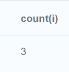

# Data modelling and seeding

```
match (a) -[r] -> () delete a, r;
match (a) delete a;

CREATE (o1:ORDER {id: "o1", date: "23.05.2023"});
CREATE (o2:ORDER {id: "o2", date: "24.05.2023"});
CREATE (o3:ORDER {id: "o3", date: "25.05.2023"});
CREATE (o4:ORDER {id: "o4", date: "26.05.2023"});

CREATE (i1:ITEM {id: "i1", name: "Laptop", price: 1200});
CREATE (i2:ITEM {id: "i2", name: "Phone", price: 600});
CREATE (i3:ITEM {id: "i3", name: "Watch", price: 400});
CREATE (i4:ITEM {id: "i4", name: "Power bank", price: 250});
CREATE (i5:ITEM {id: "i5", name: "Monitor", price: 450});

CREATE (c1:CUSTOMER {id:"c1", name: "Anton"});
CREATE (c2:CUSTOMER {id:"c2", name: "Yaroslav"});
CREATE (c3:CUSTOMER {id:"c3", name: "Volodymyr"});

MATCH   (o1:ORDER { id: "o1" }),
        (o2:ORDER { id: "o2" }),
        (o3:ORDER { id: "o3" }),
        (o4:ORDER { id: "o4" }),
        (i1:ITEM { id: "i1" }),
        (i2:ITEM { id: "i2" }),
        (i3:ITEM { id: "i3" }),
        (i4:ITEM { id: "i4" }),
        (i5:ITEM { id: "i5" }),
        (c1:CUSTOMER { id:"c1" }),
        (c2:CUSTOMER { id:"c2" }),
        (c3:CUSTOMER { id:"c3" })
CREATE
        (c1)-[rel_b_1:BOUGHT]->(o1)-[rel_c_1:CONTAINS]->(i1),
        (c1)-[rel_b_2:BOUGHT]->(o2)-[rel_c_2:CONTAINS]->(i2),
                               (o2)-[rel_c_3:CONTAINS]->(i3),
        (c2)-[rel_b_4:BOUGHT]->(o3)-[rel_c_4:CONTAINS]->(i1),
                               (o3)-[rel_c_5:CONTAINS]->(i4),
        (c3)-[rel_b_6:BOUGHT]->(o4)-[rel_c_6:CONTAINS]->(i5),
        (c1)-[rel_v_1:VIEWS]->(i4),
        (c2)-[rel_v_2:VIEWS]->(i2);

MATCH (n) RETURN (n);
```


# Queries

## Знайти Items які входять в конкретний Order (за Order id)
```
MATCH (o:ORDER { id: 'o2' })-[:CONTAINS]->(i:ITEM)
RETURN i
```


## Підрахувати вартість конкретного Order
```
MATCH (o:ORDER { id: 'o2' })-[:CONTAINS]->(i:ITEM)
RETURN sum(i.price)
```


## Підрахувати вартість конкретного Order
```
MATCH (o:ORDER { id: 'o2' })-[:CONTAINS]->(i:ITEM)
RETURN sum(i.price)
```
![img_2.png]

## Знайти всі Orders конкретного Customer
```
MATCH (c:CUSTOMER { id: 'c1' })-[:BOUGHT]->(o:ORDER)
RETURN o
```


## Знайти всі Items куплені конкретним Customer (через його Orders)
```
MATCH (c:CUSTOMER { id: 'c1' })-[:BOUGHT]->()-[:CONTAINS]->(i:ITEM)
RETURN i
```


## Знайти загальну кількість Items куплені конкретним Customer (через його Order)
```
MATCH (c:CUSTOMER { id: 'c1' })-[:BOUGHT]->()-[:CONTAINS]->(i:ITEM)
RETURN count(i)
```


## Знайти для Customer на яку загальну суму він придбав товарів (через його Order)
```
MATCH (c:CUSTOMER { id: 'c1' })-[:BOUGHT]->()-[:CONTAINS]->(i:ITEM)
RETURN sum(i.price)
```


## Знайті скільки разів кожен товар був придбаний, відсортувати за цим значенням
```
MATCH (o:ORDER)-[:CONTAINS]->(i:ITEM)
RETURN i, count(i)
ORDER BY count(i) DESC
LIMIT 10
```


## Знайти всі Items переглянуті (view) конкретним Customer
```
MATCH (c:CUSTOMER { id: 'c1' })-[:VIEWS]->(i:ITEM)
RETURN i
```


## Знайти інші Items що купувались разом з конкретним Item (тобто всі Items що входять до Order-s разом з даними Item)
```
MATCH (i:ITEM { id: 'i1' })<-[:CONTAINS]-(o:ORDER)-[:CONTAINS]->(i2:ITEM)
RETURN i2
```


## Знайти Customers які купили даний конкретний Item
```
MATCH (i:ITEM { id: 'i1' })<-[:CONTAINS]-(o:ORDER)<-[:BOUGHT]->(c:CUSTOMER)
RETURN c
```


## Знайти для певного Customer(а) товари, які він переглядав, але не купив
```
MATCH (c:CUSTOMER { id: 'c1' })-[:VIEWS]->(i:ITEM)
WHERE NOT (i)<-[:BOUGHT]-()
RETURN i
```
