## Part 1

### Data modelling
```
CREATE KEYSPACE IF NOT EXISTS shop
    WITH replication = {
        'class' : 'SimpleStrategy',
        'replication_factor' : 1
        };

USE shop;

DROP TABLE IF EXISTS items;
DROP INDEX IF EXISTS items_other_idx1;
DROP INDEX IF EXISTS items_other_idx2;

CREATE TABLE items (
                       id int,
                       name text,
                       price int,
                       producer text,
                       category text,
                       other map<text, text>,
                       PRIMARY KEY ( category, price, producer )
);

CREATE INDEX IF NOT EXISTS items_other_idx1
    ON items ( ENTRIES(other) );
CREATE INDEX IF NOT EXISTS items_other_idx2
    ON items ( KEYS(other) );

INSERT INTO items (id, name, price, producer, category, other)
VALUES (1, 'Macbook m1', 1600, 'Apple', 'Laptops', {'touchscreen': 'false'});
INSERT INTO items (id, name, price, producer, category, other)
VALUES (2, 'ThinkPad', 1200, 'Lenovo', 'Laptops', {'os': 'windows 11'});
INSERT INTO items (id, name, price, producer, category, other)
VALUES (3, 'xps 15', 1500, 'Dell', 'Laptops', {'lightweight': 'true'});

INSERT INTO items (id, name, price, producer, category, other)
VALUES (4, 'iPhone 12', 800, 'Apple', 'Phones', {'camera': '9999MP'});
INSERT INTO items (id, name, price, producer, category, other)
VALUES (5, 'Samsung M31', 400, 'Samsung', 'Phones', {'processor': 'exynos'});
INSERT INTO items (id, name, price, producer, category, other)
VALUES (6, 'Nokia c3210', 50, 'Nokia', 'Phones', {'durable': 'true'});

INSERT INTO items (id, name, price, producer, category, other)
VALUES (7, 'AppleWatch 3', 400, 'Apple', 'Watches', {'waterproof': 'true', 'os': 'watchos'});
INSERT INTO items (id, name, price, producer, category, other)
VALUES (8, 'SmartWatch 2', 300, 'Samsung', 'Watches', {});
INSERT INTO items (id, name, price, producer, category, other)
VALUES (9, 'Mi band 6', 150, 'Huawei', 'Watches', {'bluetooth': 'true'});
```

### Напишіть запит, який показує структуру створеної таблиці (команда DESCRIBE)
```
DESCRIBE TABLE items;
```
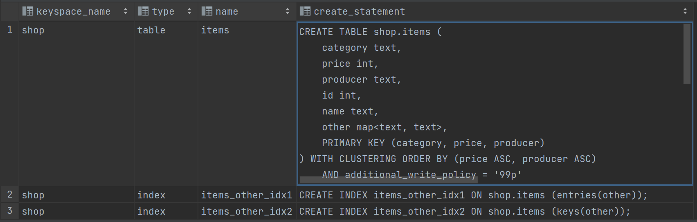

### Напишіть запит, який виводить усі товари в певній категорії відсортовані за ціною
```
SELECT *
FROM items
WHERE category = 'Laptops' ORDER BY price;
```
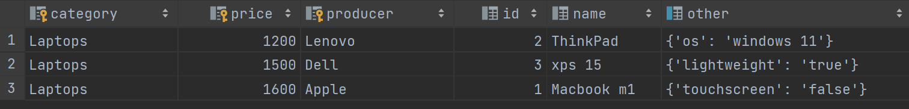

### Напишіть запити, які вибирають товари за різними критеріями в межах певної категорії:
#### назва
```
CREATE MATERIALIZED VIEW items_by_name
AS SELECT *
FROM items
WHERE category IS NOT NULL AND name IS NOT NULL AND price IS NOT NULL AND producer IS NOT NULL
PRIMARY KEY ( category, name, price, producer );

SELECT *
FROM items_by_name
WHERE category = 'Laptops' AND name > 'Macbook m1';
```
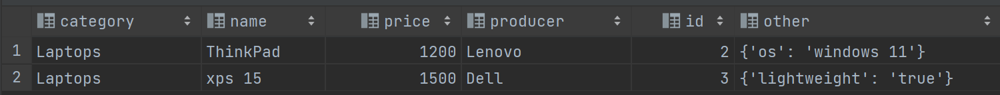

#### ціна (в проміжку)
```
SELECT *
FROM items
WHERE category = 'Laptops' AND price >= 1200 AND price < 1600;
```
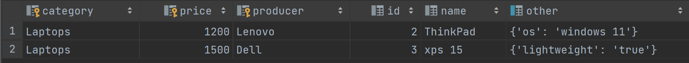

#### ціна та виробник
```
SELECT *
FROM items
WHERE category = 'Laptops' AND price = 1600 AND producer = 'Apple';
```
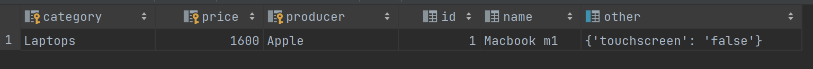

### Напишіть запити, які вибирають товари за:
#### наявність певних характеристик
```
SELECT *
FROM items
WHERE other CONTAINS KEY 'bluetooth';
```
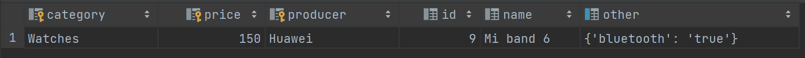

#### певна характеристика та її значення
```
SELECT *
FROM items
WHERE other['bluetooth'] = 'true';
```


### Оновити опис товару:
#### змінить існуючі значення певної характеристики
```
UPDATE items
SET name = 'Macbook m2'
WHERE category = 'Laptops' AND price = 1600 AND producer = 'Apple';
```

#### додайте нові властивості (характеристики) товару
```
UPDATE items
SET other = other + {'processor': 'very fast'}
WHERE category = 'Laptops' AND price = 1600 AND producer = 'Apple';
```

#### видалить характеристику товару
```
UPDATE items
SET other = other - {'processor'}
WHERE category = 'Laptops' AND price = 1600 AND producer = 'Apple';
```

## Part 2

### Data modelling
```
DROP MATERIALIZED VIEW IF EXISTS orders_by_cost;
DROP TABLE IF EXISTS orders;
DROP INDEX IF EXISTS orders_items_idx1;

CREATE TABLE orders (
id int,
cost int,
date date,
customer text,
items list<int>,
PRIMARY KEY ( customer, date )
);

CREATE INDEX IF NOT EXISTS orders_items_idx1
ON orders ( items );

INSERT INTO orders (id, cost, date, customer, items)
VALUES (1, 2800, '2023-03-26', 'Anton', [1, 2]);
INSERT INTO orders (id, cost, date, customer, items)
VALUES (2, 1550, '2023-03-26', 'Yaroslav', [3, 6]);
INSERT INTO orders (id, cost, date, customer, items)
VALUES (3, 850, '2023-03-25', 'Eugene', [7, 8, 9]);
INSERT INTO orders (id, cost, date, customer, items)
VALUES (4, 700, '2023-03-25', 'Yaroslav', [7, 8]);
```
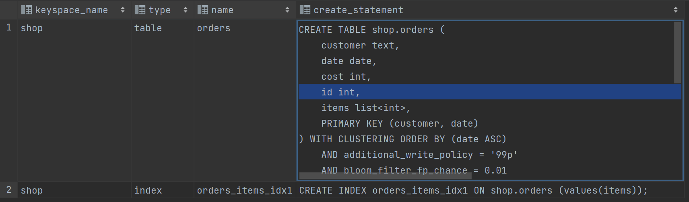

### Для замовника виведіть всі його замовлення відсортовані за часом коли вони були зроблені
```
SELECT *
FROM orders
WHERE customer = 'Yaroslav' ORDER BY date;
```
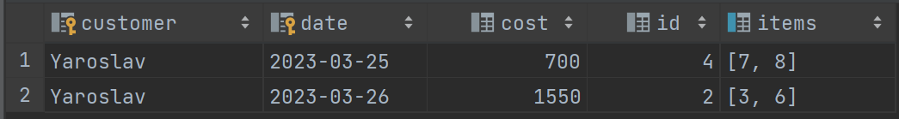

### Для замовника знайдіть замовлення з певним товаром
```
SELECT *
FROM orders
WHERE customer = 'Yaroslav' AND items CONTAINS 3;
```
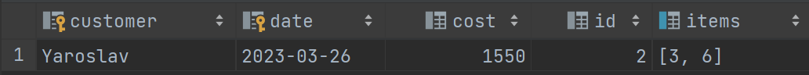

### Для замовника знайдіть замовлення за певний період часу і їх кількість
```
SELECT *
FROM orders
WHERE customer = 'Yaroslav' AND date > '2023-03-25';

SELECT count(*)
FROM orders
WHERE customer = 'Yaroslav' AND date > '2023-03-25';
```
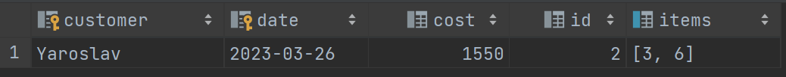

### Для кожного замовників визначте суму на яку були зроблені усі його замовлення
```
SELECT sum(cost)
FROM orders
WHERE customer = 'Yaroslav';
```
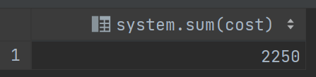

### Для кожного замовників визначте замовлення з максимальною вартістю
```
CREATE MATERIALIZED VIEW orders_by_cost
AS SELECT *
   FROM orders
   WHERE cost IS NOT NULL AND date IS NOT NULL AND customer IS NOT NULL
PRIMARY KEY ( customer, cost, date )
WITH CLUSTERING ORDER BY ( cost DESC, date ASC );

SELECT *
FROM orders_by_cost
GROUP BY customer;
```
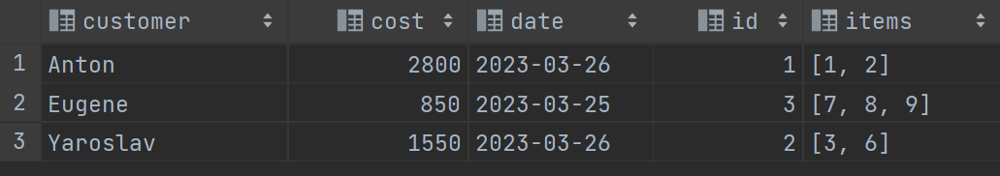

### Модифікуйте певне замовлення додавши / видаливши один або кілька товарів при цьому також змінюючи вартість замовлення
```
UPDATE orders
SET items = items + [3], cost = 2800 + 1500 -- can use 'counter' data type as well
WHERE customer = 'Anton' AND date = '2023-03-26';
```

### Для кожного замовлення виведіть час коли його ціна були занесена в базу (SELECT WRITETIME)
```
SELECT id, WRITETIME (cost) FROM orders;
```
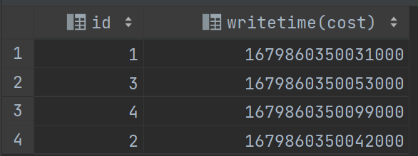

### Створіть замовлення з певним часом життя (TTL), після якого воно видалиться
```
INSERT INTO orders (id, cost, date, customer, items)
VALUES (5, 400, '2023-03-25', 'Yaroslav', [7])
USING TTL 3000;
```

### Поверніть замовлення у форматі JSON
```
SELECT JSON *
FROM orders;
```
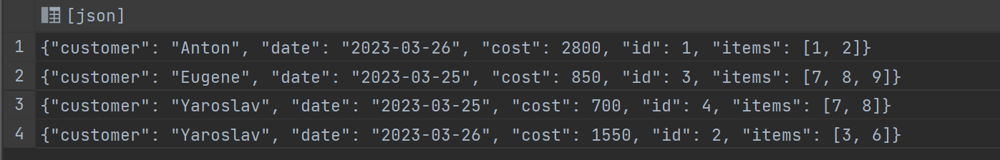

### Додайте замовлення у форматі JSON
```
INSERT INTO orders JSON '{"customer": "Anton", "date": "2023-03-27", "cost": 4300, "id": 6, "items": [1, 2, 3]}';
```


